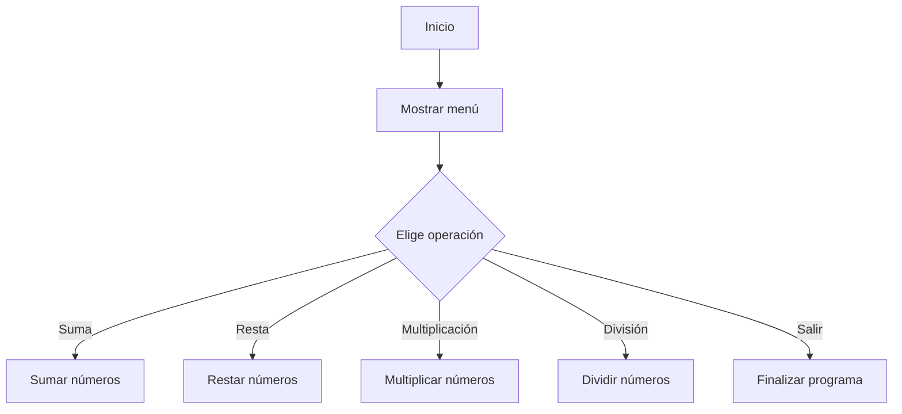

# Calculadora en Python

## Índice

- [Acerca del proyecto](#acerca-del-proyecto)
  - [Estado del proyecto](#estado-del-proyecto)
  - [Mis herramientas](#mis-herramientas)
- [Empecemos](#empecemos)
  - [Checklist](#checklist)
  - [Mi paso a paso](#mi-paso-a-paso)
- [Pongámoslo a prueba](#pongamoslo-a-prueba)
- [Roadmap](#roadmap)

---

<details>
  <summary>¿Qué voy a encontrarme?</summary>
  <ol>
    <li>
      <a href="#acerca-del-proyecto">Acerca del proyecto</a>
      <ul>
        <li><a href="#estado-del-proyecto">Estado del proyecto</a></li>
        <li><a href="#mis-herramientas">Mis herramientas</a></li>
      </ul>
    </li>
    <li>
      <a href="#empecemos">Empecemos</a>
      <ul>
        <li><a href="#checklist">Checklist</a></li>
        <li><a href="#mi-paso-a-paso">Mi paso a paso</a></li>
      </ul>
    </li>
    <li><a href="#pongamoslo-a-prueba">Pongámoslo a prueba</a></li>
    <li><a href="#roadmap">Roadmap</a></li>
  </ol>
</details>

---

## Acerca del proyecto

### 🌟 Descripción

Esta es una calculadora en Python que permite realizar operaciones matemáticas básicas: **suma, resta, multiplicación y división**.

El usuario ingresa dos números y elige la operación deseada a través de un menú en consola. Se validan los datos de entrada para evitar errores y, en caso de intentar dividir por 0, el programa muestra un mensaje de error.

El programa se ejecuta en un bucle hasta que el usuario decide salir.

### Estado del proyecto

:construction: Proyecto en construcción :construction:

### Mis herramientas

* [Python 3](https://www.python.org/)
* [Documentación oficial de Python](https://docs.python.org/3/)

---

## Empecemos

### Checklist

- [X] Crear funciones para cada operación.
- [X] Implementar menú interactivo en consola.
- [X] Manejo de errores para entradas no válidas y división por cero.
- [X] Crear un bucle que permita repetir las operaciones hasta que el usuario salga.
- [ ] Agregar interfaz gráfica (Tkinter o Flask).
- [ ] Ampliar operaciones (potencias, raíz cuadrada, etc.).

### Mi paso a paso

> [!WARNING]
> Todo lo escrito es en base a mi experiencia. Cada quien tiene su propio camino y tiempo. Espero que lo tomes como un complemento a tu formación y no como las sagradas escrituras.

#### Estructura del código

- Funciones separadas para cada operación.
- Una función principal que gestiona el menú y las entradas del usuario.
- Un bucle `while` que permite ejecutar el programa hasta que el usuario decida salir.

**Ejemplo de código:**

```python
# Definición de operaciones

def suma(a, b):
    return a + b

def resta(a, b):
    return a - b

def multiplicacion(a, b):
    return a * b

def division(a, b):
    if b == 0:
        return "Error: No se puede dividir por cero."
    return a / b

# Menú principal
def calculadora():
    while True:
        print("\nCalculadora en Python")
        print("1. Sumar")
        print("2. Restar")
        print("3. Multiplicar")
        print("4. Dividir")
        print("5. Salir")
        opcion = input("Elige una opción: ")

        if opcion == '5':
            print("Saliendo...")
            break
        
        num1 = float(input("Ingresa el primer número: "))
        num2 = float(input("Ingresa el segundo número: "))

        if opcion == '1':
            print("Resultado:", suma(num1, num2))
        elif opcion == '2':
            print("Resultado:", resta(num1, num2))
        elif opcion == '3':
            print("Resultado:", multiplicacion(num1, num2))
        elif opcion == '4':
            print("Resultado:", division(num1, num2))
        else:
            print("Opción inválida. Intenta de nuevo.")

# Ejecutar calculadora
calculadora()
```

---

## Pongámoslo a prueba


---

## Roadmap

**Posibles mejoras:**

- Agregar una interfaz gráfica con Tkinter o Flask.
- Incluir soporte para operaciones avanzadas como potencias y raíces cuadradas.
- Integrar una función de historial de operaciones realizadas.



---

# 🎉 Good Luck!


---

> Si te ha sido útil esta guía, regálame una ⭐.

**Releases**
No releases published

**Packages**
No packages published

